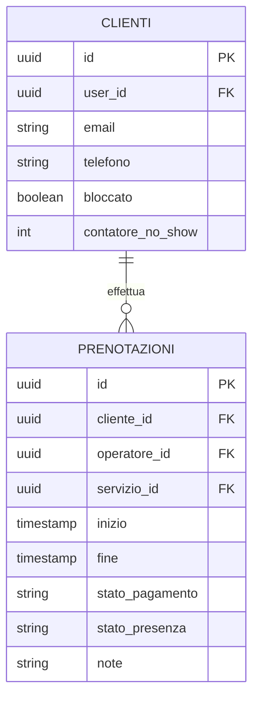

# Pagamenti e Presenze

## Perché questo approccio

Rispetto a un'integrazione di pagamento online completa, per questo progetto si è scelto un approccio più semplice: **il pagamento avviene fuori dall'app** (contanti, POS fisico, bonifico), e il gestionale si limita a **registrarne l'esito** insieme alla presenza effettiva del cliente all'appuntamento. Questo evita la complessità di un'integrazione con un gateway di pagamento (PCI-DSS, webhook, gestione rimborsi) mantenendo comunque le informazioni utili per la dashboard guadagni e per gestire i clienti che non si presentano.

## Tracciamento pagamento

Ogni prenotazione ha un campo **stato pagamento** (`non_pagato` / `pagato`), impostato manualmente dall'operatore o dall'amministratore dopo l'incasso reale. Nessuna integrazione tecnica di pagamento è richiesta: è un dato amministrativo, non una transazione elaborata dal sistema.

L'importo si ricava dal prezzo del servizio associato alla prenotazione (con possibilità di modificarlo manualmente per sconti/eccezioni), senza bisogno di una tabella pagamenti separata.

## Tracciamento presenza

Ogni prenotazione passata riceve uno stato di presenza, impostato dall'operatore/amministratore dopo l'orario dell'appuntamento:

| Stato | Significato |
|---|---|
| `da_verificare` | Stato di default finché l'appuntamento non è passato |
| `presente` | Il cliente si è presentato |
| `non_presente` | Il cliente non si è presentato (no-show) |

## Politica no-show

1. **Conteggio** — il sistema conta quante volte lo stesso indirizzo email (o numero di telefono, per chi prenota come ospite senza account) è stato marcato `non_presente`
2. **Soglia** — al raggiungimento di **2-3 no-show** (soglia configurabile in `Settings`, vedi `02-backend.md`)
3. **Azione automatica**:
   - Invio di un'**email di avviso** a quell'indirizzo, con il motivo (numero di mancate presentazioni) e le conseguenze
   - **Blocco delle prenotazioni future** da parte di quella stessa email/telefono: il sistema rifiuta nuove prenotazioni finché il blocco non viene rimosso
4. **Sblocco** — va previsto uno sblocco manuale da parte dell'amministratore (es. dopo un chiarimento con il cliente): non deve essere permanente per definizione, altrimenti si rischia di perdere clienti per un imprevisto occasionale

Questo meccanismo evita che clienti recidivi continuino a occupare posti in calendario che poi non onorano, a scapito di clienti reali che avrebbero potuto prenotare quello slot.

## Schema dati

`bloccato` e `contatore_no_show` sono i due campi aggiunti rispetto allo schema base per gestire la politica sopra descritta. Se un cliente prenota da ospite (senza account), lo stesso conteggio va tenuto per email/telefono, ad esempio con una tabella leggera `clienti_bloccati` (email/telefono → contatore, bloccato) invece di richiedere obbligatoriamente un account.

## Dashboard guadagni (lato Amministratore)

Resta prevista nel modulo Reportistica (`03-componenti-e-workflow.md`), ma ora si basa sui dati marcati manualmente invece che su un'integrazione di pagamento:

- **Guadagni totali** per periodo, sommando il prezzo delle prenotazioni con `stato_pagamento = pagato`
- **Guadagni per cliente** — somma storica per cliente, utile anche per individuare i clienti di maggior valore
- **Guadagni per servizio/categoria** e **per operatore**
- **Tasso di no-show** e elenco dei clienti vicini alla soglia di blocco — vista resa possibile proprio dal tracciamento presenze

## Notifiche collegate

Si appoggia al modulo Notifiche già previsto (`03-componenti-e-workflow.md`, `esempio-settore-parrucchiere.md`):

| Evento | Destinatario | Contenuto |
|---|---|---|
| Raggiunta soglia no-show | Cliente | Avviso del blocco e istruzioni per contattare il salone |
| Cliente bloccato/sbloccato | Amministratore | Notifica interna, utile a tenere traccia delle decisioni prese |

## Nota per il futuro

Se in futuro si volesse comunque offrire un pagamento online (es. una caparra per ridurre ulteriormente i no-show), resta un'estensione possibile — tecnicamente significherebbe aggiungere un provider come Stripe con Payment Intent e webhook — ma non è necessario per la versione attuale del progetto.

## Checklist

- [ ] Campo stato pagamento sulla prenotazione, impostabile manualmente da operatore/amministratore
- [ ] Campo stato presenza sulla prenotazione, con i tre stati definiti
- [ ] Conteggio no-show per email/telefono (anche per prenotazioni senza account)
- [ ] Soglia di no-show configurabile (default 2-3)
- [ ] Email automatica di avviso al raggiungimento della soglia
- [ ] Blocco automatico di nuove prenotazioni da email/telefono bloccati
- [ ] Sblocco manuale disponibile per l'amministratore
- [ ] Dashboard guadagni basata sui dati marcati manualmente (totale, per cliente, per servizio, per operatore)
