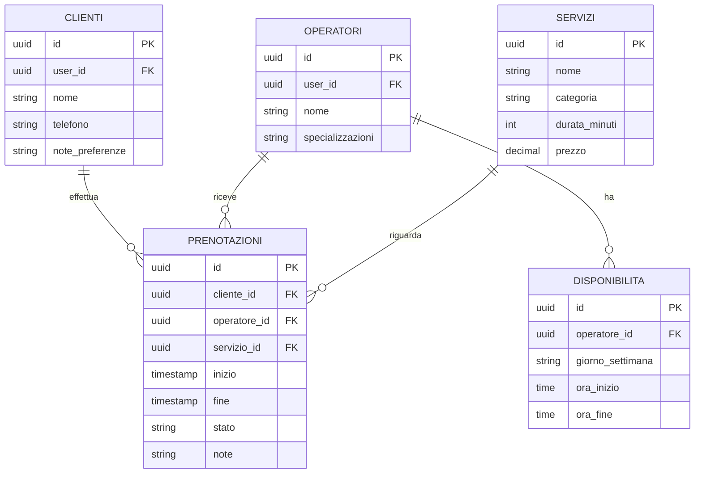

# Caso Studio: Gestionale per Salone di Parrucchiere

## Premessa

Questo documento applica lo scheletro generico (file `00`-`07`) al caso concreto di un salone di parrucchiere/centro estetico, con prenotazioni online, catalogo servizi, notifiche e gestione completa sia lato cliente sia lato amministratore. Serve come esempio di come si "riempie" lo scheletro adattabile con le decisioni specifiche di un settore reale, e può essere usato direttamente come base per una relazione, una presentazione o le specifiche funzionali del progetto.

## Ruoli utente

| Ruolo | Chi è | Cosa può fare |
|---|---|---|
| **Cliente** | Chi prenota un servizio | Sfoglia il catalogo, prenota/modifica/cancella i propri appuntamenti, riceve notifiche, vede lo storico |
| **Operatore** (parrucchiere/estetista) | Il professionista che eroga il servizio | Vede il proprio calendario, gestisce la propria disponibilità, segna gli appuntamenti come completati/no-show |
| **Amministratore** (titolare/receptionist) | Chi gestisce il salone | Tutto quello che fa l'operatore, più: gestione catalogo, gestione staff, gestione di tutte le prenotazioni, reportistica, impostazioni, invio promozioni |

Questi tre ruoli sono una specializzazione diretta del modulo "Gestione Utenti & Ruoli" già previsto nello scheletro generico (`02-backend.md`, `03-componenti-e-workflow.md`): non serve inventare un nuovo sistema di permessi, solo popolare ruoli coerenti con questi profili. Per un salone più grande, si può facilmente aggiungere un quarto ruolo intermedio (es. **Receptionist**: gestisce prenotazioni e clienti ma non catalogo/impostazioni) senza toccare l'architettura RBAC sottostante.

## Entità di dominio (specializzazione del modulo "Anagrafiche")

| Entità generica | Diventa, in questo settore | Campi principali |
|---|---|---|
| Anagrafiche | **Servizi** | nome, descrizione, categoria (taglio, colore, trattamento, barba...), durata in minuti, prezzo, foto |
| Anagrafiche | **Operatori** | nome, foto, specializzazioni, collegamento a un account utente con ruolo "operatore" |
| Anagrafiche | **Clienti** | nome, contatti, preferenze/note (es. colore abituale), storico servizi |
| (nuova) | **Prenotazioni** | cliente, operatore, servizio, data/ora inizio, data/ora fine, stato, note |
| (nuova) | **Disponibilità operatore** | turni settimanali standard + eccezioni (ferie, permessi, chiusure straordinarie) |
| (opzionale) | **Prodotti** in vendita | se il salone vende anche prodotti per capelli al dettaglio |
| (opzionale) | **Recensioni** | valutazione e commento lasciati dal cliente dopo il servizio |

**Prenotazioni** è l'unica entità realmente nuova rispetto allo scheletro base: è il cuore di questo settore specifico.

## Catalogo

Il "catalogo" in questo contesto è tipicamente il **listino servizi**: elenco organizzato per categoria, ciascuno con nome, descrizione breve, durata e prezzo, spesso con una foto rappresentativa. Lato cliente va mostrato con filtri per categoria e, se utile, un'opzione "solo servizi disponibili con il mio operatore preferito".

Due estensioni facoltative, da valutare in base al salone reale:
- **Catalogo prodotti**: se il salone vende anche prodotti per la cura dei capelli, è un piccolo modulo e-commerce aggiuntivo (catalogo prodotti + carrello semplice), non strettamente necessario alla prenotazione.
- **Galleria stili/lookbook**: foto di tagli/acconciature realizzati, utile per ispirare il cliente in fase di prenotazione, ma puramente informativa (una galleria immagini, senza logica applicativa particolare).

## Funzionalità lato Cliente

1. **Catalogo servizi** — sfoglia/filtra i servizi per categoria, vede prezzo e durata
2. **Prenotazione**:
   - Sceglie il servizio (o più servizi in un unico appuntamento, se supportato)
   - Sceglie l'operatore, oppure "primo disponibile" (decisione di prodotto da fissare: obbligare la scelta o no)
   - Vede gli slot realmente liberi (calcolati incrociando durata del servizio, turno dell'operatore e prenotazioni già esistenti)
   - Conferma la prenotazione
3. **Gestione delle proprie prenotazioni** — vede i prossimi appuntamenti, può modificarli o cancellarli nel rispetto della policy di cancellazione (vedi sotto)
4. **Notifiche** — conferma immediata, promemoria prima dell'appuntamento, avviso in caso di cancellazione/modifica da parte del salone
5. **Storico** — appuntamenti passati, eventualmente con "riprenota lo stesso servizio"
6. **(Opzionale) Recensione** post-servizio
7. **(Opzionale) Programma fedeltà** (es. un servizio omaggio ogni N prenotazioni)

## Funzionalità lato Amministratore/Staff

1. **Gestione catalogo servizi** — CRUD su servizi, categorie, prezzi, durate, foto
2. **Gestione staff** — anagrafica operatori, specializzazioni, turni settimanali standard, eccezioni (ferie/permessi/chiusure)
3. **Calendario prenotazioni** — vista giornaliera/settimanale, per singolo operatore o su tutto il salone, con possibilità di creare/spostare/cancellare appuntamenti manualmente (es. per prenotazioni telefoniche)
4. **Gestione prenotazioni** — conferma, modifica, cancellazione, marcatura come completata o no-show
5. **Gestione clienti** — anagrafica, storico servizi, note interne (non visibili al cliente)
6. **Notifiche e promozioni** — invio mirato (es. "sconto sul colore per chi non prenota da 60 giorni"), sempre nel rispetto delle preferenze di consenso del cliente
7. **Reportistica** — fatturato per periodo/servizio/operatore, servizi più richiesti, tasso di cancellazione e no-show, occupazione media per operatore
8. **Impostazioni** — orari di apertura, giorni di chiusura, buffer tra un appuntamento e l'altro, politica di cancellazione, numero massimo di prenotazioni anticipate per cliente

## Logica di business specifica delle prenotazioni

Questa è la parte più delicata e specifica del settore, da progettare con attenzione:

- **Calcolo della disponibilità**: uno slot è libero solo se rientra nel turno dell'operatore, non si sovrappone a un'altra prenotazione dello stesso operatore, e lascia lo spazio necessario (durata del servizio + eventuale buffer di pulizia/preparazione, es. 10 minuti)
- **Prevenzione doppia prenotazione**: va garantita sia lato applicativo (controllo prima di confermare) sia, idealmente, con un vincolo a livello di database (es. un indice di esclusione in PostgreSQL sulle fasce orarie per operatore) per evitare race condition con prenotazioni simultanee
- **Policy di cancellazione**: da definire esplicitamente (es. cancellabile gratuitamente fino a 24h prima, altrimenti addebito o blocco delle prenotazioni future) e da mostrare chiaramente al cliente prima della conferma
- **No-show**: tracciare i mancati appuntamenti per statistiche e per limitare le prenotazioni future di clienti recidivi — la politica specifica (soglia, email automatica, blocco) è descritta in `08-pagamenti.md`
- **(Opzionale) Lista d'attesa**: se un giorno è completo, il cliente può iscriversi a una lista d'attesa e ricevere una notifica se si libera uno slot
- **(Opzionale) Prenotazioni ricorrenti**: utile per clienti abituali (es. "ogni 4 settimane, stesso giorno e ora")

## Schema dati (estensione dello schema generico)

`CLIENTI` e `OPERATORI` estendono `users` (schema generico in `02-backend.md`) con un collegamento `user_id`, invece di duplicare i campi di autenticazione.

## Notifiche specifiche del settore

| Evento | Destinatario | Canale consigliato |
|---|---|---|
| Conferma prenotazione | Cliente | In-app + email/push immediata |
| Promemoria (es. 24h prima) | Cliente | Push (ideale per una PWA) o email |
| Cancellazione/modifica da parte del salone | Cliente | Push/email immediata |
| Nuova prenotazione ricevuta | Operatore/Admin | In-app, eventualmente push |
| Promozione mirata | Cliente (solo con consenso) | Email/push, rispettando le preferenze di opt-in |

Le notifiche push sono un caso d'uso perfetto per la natura PWA del progetto (vedi `04-pwa-checklist.md`): un promemoria push il giorno prima riduce concretamente i no-show.

## Cosa resta invariato rispetto allo scheletro generico

- **Autenticazione, RBAC, sicurezza** (`02-backend.md`) — nessuna modifica concettuale, solo i ruoli specifici sopra descritti
- **PWA** (`04-pwa-checklist.md`) — invariato; installabilità e notifiche push sono particolarmente utili per un pubblico che prenota dal telefono
- **Docker/CI-CD** (`06-docker-e-cicd.md`) — invariato
- **Import/Export** (`07-import-export-dati.md`) — utile in fase di avvio per importare l'anagrafica clienti esistente da un vecchio registro o da Excel

## Cosa si aggiunge rispetto allo scheletro generico

- Un nuovo modulo **Calendario/Disponibilità**, non presente nello scheletro base, con la relativa logica di calcolo degli slot liberi
- La **Dashboard** avrà KPI specifici del settore: prenotazioni di oggi, tasso di occupazione della giornata, fatturato del periodo, servizi più richiesti
- La **Reportistica** si arricchisce di metriche specifiche (occupazione per operatore, tasso di no-show)

## Nota

Se tra le note cliente si raccolgono informazioni assimilabili a dati sulla salute (es. allergie a prodotti chimici), va trattata con l'attenzione aggiuntiva che il GDPR riserva alle categorie particolari di dati, anche in un progetto di piccole dimensioni.

## Checklist riassuntiva

- [ ] Ruoli Cliente / Operatore / Amministratore configurati con permessi corretti
- [ ] Catalogo servizi con categorie, prezzi, durate
- [ ] Calcolo disponibilità funzionante (turni + prenotazioni esistenti + buffer)
- [ ] Prevenzione doppia prenotazione verificata anche in caso di richieste simultanee
- [ ] Policy di cancellazione definita e mostrata chiaramente al cliente
- [ ] Notifiche di conferma, promemoria e cancellazione funzionanti
- [ ] Calendario amministrativo per operatore/salone
- [ ] Reportistica di base (fatturato, occupazione, no-show)
- [ ] (Se rilevante) Import dell'anagrafica clienti esistente
